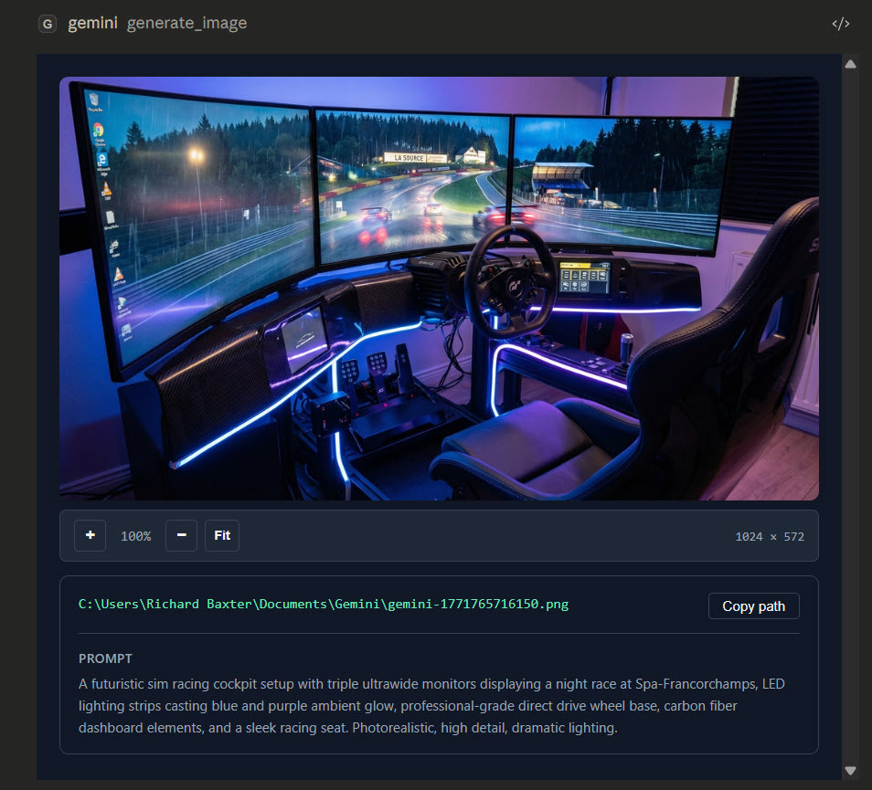
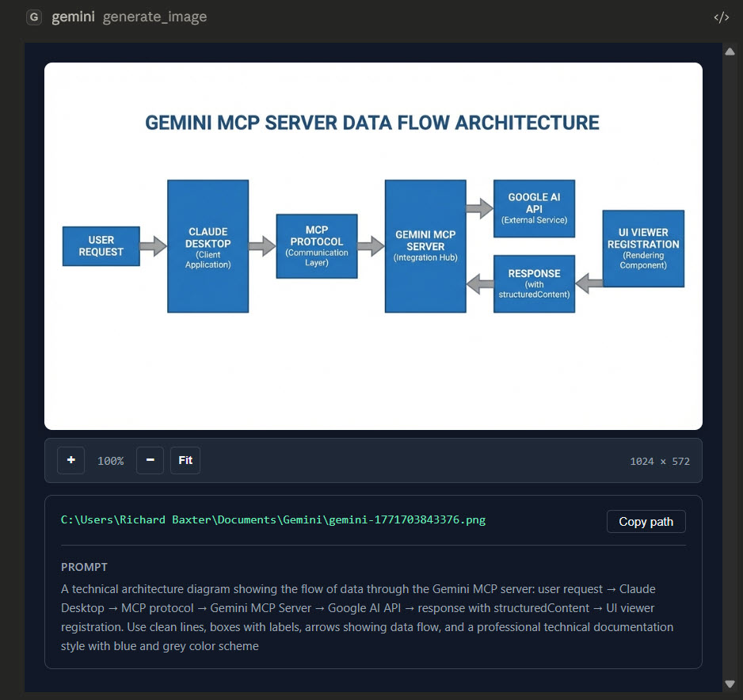

# @houtini/gemini-mcp

[](https://www.npmjs.com/package/@houtini/gemini-mcp)
[](https://registry.modelcontextprotocol.io)
[](https://snyk.io/test/github/houtini-ai/gemini-mcp)
${badge_line}

**I've been running this MCP server in my Claude Desktop setup for several months, and it's one of the few I leave enabled permanently.** Not because Gemini replaces Claude -- it doesn't -- but because grounded search, deep research, image generation, and video are things Gemini does well. Having them as tools inside Claude beats switching between browser tabs.

Thirteen tools. One `npx` command.

### MCP App previews

Generated images and diagrams render inline in Claude Desktop with zoom controls, file paths, and prompt context:

| Image generation | SVG / diagram generation |
|:---:|:---:|
|  |  |

---

## Get started in two minutes

**Step 1: Get a Gemini API key**

Go to [Google AI Studio](https://aistudio.google.com/apikey) and create one. The free tier covers most development use -- you'll hit rate limits on deep research if you're hammering it, but for day-to-day work it's fine.

**Step 2: Add to your Claude Desktop config**

Config file locations:
- Windows: `C:\Users\{username}\AppData\Roaming\Claude\claude_desktop_config.json`
- macOS: `~/Library/Application Support/Claude/claude_desktop_config.json`

```json
{
  "mcpServers": {
    "gemini": {
      "command": "npx",
      "args": ["@houtini/gemini-mcp"],
      "env": {
        "GEMINI_API_KEY": "your-api-key-here"
      }
    }
  }
}
```

**Step 3: Restart Claude Desktop**

That's it. The tools show up automatically. `npx` pulls the package on first run -- no separate install.

### Local build instead

For development, or if you'd rather not rely on npx:

```bash
git clone https://github.com/houtini-ai/gemini-mcp
cd gemini-mcp
npm install --include=dev
npm run build
```

Then point your config at the local build:

```json
{
  "mcpServers": {
    "gemini": {
      "command": "node",
      "args": ["C:/path/to/gemini-mcp/dist/index.js"],
      "env": {
        "GEMINI_API_KEY": "your-api-key-here"
      }
    }
  }
}
```

---

## What it does

### Chat with Google Search grounding

```
Use gemini:gemini_chat to ask: "What changed in the MCP spec in the last month?"
```

Grounding is on by default. Gemini searches Google before answering, so you get current information rather than training data cutoff answers. Sources come back as markdown links.

For questions where you want reasoning over live search -- "explain this code" or similar -- set `grounding: false`.

Supports `thinking_level` on Gemini 3 models: `high` for maximum reasoning depth, `low` to keep it fast, `medium`/`minimal` on Gemini 3 Flash only.

### Deep research

```
Use gemini:gemini_deep_research with:
  research_question="What are the current approaches to AI agent memory management?"
  max_iterations=5
```

Runs multiple grounded search iterations, then synthesises a full report. Takes 2-5 minutes depending on complexity. Worth it for anything where you need comprehensive coverage rather than a quick answer.

Set `max_iterations` to 3-4 in Claude Desktop (4-minute tool timeout). In IDEs (Cursor, Windsurf, VS Code) or agent frameworks with longer timeout tolerance, 7-10 iterations produces noticeably better synthesis. Pass `focus_areas` as an array to steer toward specific angles.

### Image generation with search grounding

```
Use gemini:generate_image with:
  prompt="Stock price chart showing Apple (AAPL) closing prices for the last 5 trading days"
  use_search=true
  aspectRatio="16:9"
```

Default model is `gemini-3-pro-image-preview` (Nano Banana Pro). Also supports `gemini-2.5-flash-image` for faster generation.

When `use_search=true`, Gemini searches Google for current data before generating. Financial and news queries work reliably and return 2-5 grounding sources as markdown links. Weather queries are inconsistent (Gemini API limitation, not a code issue).

### Video generation with Veo 3.1

```
Use gemini:generate_video with:
  prompt="A close-up shot of a futuristic coffee machine brewing a glowing blue espresso, steam rising dramatically. Cinematic lighting."
  resolution="1080p"
  durationSeconds=8
```

Uses Google's Veo 3.1 model. Generates 4-8 second videos at up to 4K resolution with native synchronised audio. Processing takes 2-5 minutes -- the tool polls automatically until the video is ready.

Options worth knowing about:
- `aspectRatio` -- `16:9` (landscape, default) or `9:16` (portrait/vertical)
- `generateAudio` -- on by default, produces dialogue and sound effects matching the prompt
- `sampleCount` -- generate up to 4 variations in one call
- `seed` -- for deterministic output across runs
- `generateThumbnail` -- extracts a frame via ffmpeg (needs ffmpeg in PATH)
- `generateHTMLPlayer` -- creates a local HTML player alongside the video

### SVG generation

```
Use gemini:generate_svg with:
  prompt="Architecture diagram showing a microservices system with API gateway, three services, and a shared database"
  style="technical"
  width=1000
  height=600
```

Generates clean, production-ready SVG code for diagrams, illustrations, icons, and data visualisations. Styles: `technical` (diagrams), `artistic` (illustrations), `minimal` (simple), `data-viz` (charts).

### Image editing and analysis

**Conversational editing** -- Gemini 3 Pro Image maintains context across editing turns using thought signatures. The server captures these automatically. Pass them back on subsequent edit calls for full continuity:

```
Use gemini:edit_image with:
  prompt="Change the colour scheme to blue and green"
  images=[{data: imageBase64, mimeType: "image/png", thoughtSignature: "fromPreviousCall"}]
```

Skip thought signatures and each edit starts from scratch.

**Analysis** -- two tools for different purposes:
- `describe_image` -- Fast general descriptions using Gemini 3 Flash
- `analyze_image` -- Structured extraction and detailed reasoning using Gemini 3.1 Pro

**Load local files:**
```
Use gemini:load_image_from_path with filePath="C:/screenshots/error.png"
```
Returns base64 data ready for any image tool.

### Media resolution control

Reduce token usage by up to 75% whilst maintaining quality:

| Level | Tokens | Savings | Best for |
|-------|--------|---------|----------|
| `MEDIA_RESOLUTION_LOW` | 280 | 75% | Simple tasks, bulk operations |
| `MEDIA_RESOLUTION_MEDIUM` | 560 | 50% | PDFs/documents (OCR saturates here) |
| `MEDIA_RESOLUTION_HIGH` | 1120 | default | Detailed analysis |
| `MEDIA_RESOLUTION_ULTRA_HIGH` | 2000+ | per-image only | Maximum detail |

For PDF OCR, MEDIUM gives identical text extraction quality to HIGH at half the tokens. Set `global_media_resolution` to apply to all images, or override per-image with `mediaResolution`.

### Landing page generation

```
Use gemini:generate_landing_page with:
  brief="A SaaS tool that helps developers monitor API latency"
  companyName="PingWatch"
  primaryColour="#6366F1"
  style="startup"
  sections=["hero", "features", "pricing", "cta"]
```

Returns a self-contained HTML file -- inline CSS and vanilla JS, no external dependencies. Styles: `minimal`, `bold`, `corporate`, `startup`.

### Professional chart design systems

The `gemini_prompt_assistant` tool includes 9 professional chart design systems:

| System | Inspiration | Best for |
|--------|------------|----------|
| **storytelling** | Cole Nussbaumer Knaflic | Executive presentations -- everything muted except one bold highlight |
| **financial** | Financial Times | Editorial journalism -- FT Pink background, serif titles |
| **terminal** | Bloomberg / Fintech | High-density dark mode with electric neon |
| **modernist** | W.E.B. Du Bois | Bold geometric blocks, stark contrasts |
| **professional** | IBM Carbon / Tailwind | Enterprise dashboards |
| **editorial** | FiveThirtyEight / Economist | Data journalism |
| **scientific** | Nature / Science | Academic rigour |
| **minimal** | Edward Tufte | Maximum data-ink ratio |
| **dark** | Observable | Modern dark mode |

```
Use gemini:gemini_prompt_assistant with:
  request_type="template"
  use_case="product"
  desired_outcome="Generate a professional product comparison chart"
```

### Help system

```
Use gemini:gemini_help with topic="overview"
```

Documentation for all features without leaving Claude. Topics: `overview`, `image_generation`, `image_editing`, `image_analysis`, `chat`, `deep_research`, `grounding`, `media_resolution`, `models`, `all`.

---

## Image output and storage

**Default behaviour:** Images return as inline base64 previews (quality 100, 1024px) rendered directly in Claude.

**Persistent storage:** Set `GEMINI_IMAGE_OUTPUT_DIR` to auto-save all generated images:

```json
"env": {
  "GEMINI_API_KEY": "your-api-key-here",
  "GEMINI_IMAGE_OUTPUT_DIR": "C:/Users/username/Pictures/gemini-output"
}
```

Every image saves with a timestamp filename. The tool returns both the inline preview and the file path.

**Per-call override:** Pass `outputPath` on any generation tool to save to a specific location.

The server uses a two-tier compression approach to handle the MCP protocol's ~1MB JSON-RPC limit whilst preserving full-resolution files on disk:

| Tier | Quality | Max dimension | Purpose |
|------|---------|---------------|---------|
| **Full-res** | Original | Original | Saved to disk |
| **Viewer preview** | 100 | 1024px | MCP App inline preview (~400KB) |

Gemini returns 2-5MB images. The full image is saved to disk immediately, and a compressed preview is created for the MCP App viewer.

---

## Configuration reference

| Variable | Required | Default | Description |
|----------|----------|---------|-------------|
| `GEMINI_API_KEY` | Yes | -- | Google AI API key from [AI Studio](https://aistudio.google.com/apikey) |
| `GEMINI_DEFAULT_MODEL` | No | `gemini-3.1-pro-preview` | Default model for `gemini_chat` and `analyze_image` |
| `GEMINI_DEFAULT_GROUNDING` | No | `true` | Enable Google Search grounding by default |
| `GEMINI_IMAGE_OUTPUT_DIR` | No | -- | Auto-save directory for generated images |
| `GEMINI_ALLOW_EXPERIMENTAL` | No | `false` | Include experimental/preview models in auto-discovery |
| `GEMINI_MCP_LOG_FILE` | No | `false` | Write logs to `~/.gemini-mcp/logs/` |
| `DEBUG_MCP` | No | `false` | Log to stderr for debugging tool calls |

---

## Tools reference

| Tool | Description |
|------|-------------|
| `gemini_chat` | Chat with Gemini 3.1 Pro. Google Search grounding on by default. Supports `thinking_level` for Gemini 3 |
| `gemini_deep_research` | Multi-step iterative research with Google Search. Synthesises comprehensive reports |
| `gemini_list_models` | Lists available models from the API |
| `gemini_help` | Documentation for all features without leaving Claude |
| `gemini_prompt_assistant` | Expert guidance for image generation with 9 chart design systems |
| `generate_image` | Image generation with search grounding and thought signatures for conversational editing |
| `edit_image` | Edit images with natural-language instructions. Supports multi-turn continuity |
| `describe_image` | Fast image descriptions using Gemini 3 Flash |
| `analyze_image` | Structured extraction and analysis using Gemini 3.1 Pro |
| `load_image_from_path` | Read a local image file and return base64 for any image tool |
| `generate_video` | Video generation with Veo 3.1 -- 4-8 seconds at up to 4K with native audio |
| `generate_svg` | Production-ready SVG graphics for diagrams, illustrations, and data visualisations |
| `generate_landing_page` | Self-contained HTML landing pages with inline CSS/JS |

---

## Model reference

| Model | Used by | Notes |
|-------|---------|-------|
| `gemini-3.1-pro-preview` | `gemini_chat`, `analyze_image` | Default. Advanced reasoning |
| `gemini-3-pro-image-preview` | `generate_image`, `edit_image` | Nano Banana Pro -- highest quality generation |
| `gemini-2.5-flash-image` | `generate_image` (optional) | Faster generation, higher volume |
| `gemini-3-flash-preview` | `describe_image` | Fast general descriptions |
| `veo-3.1-generate-preview` | `generate_video` | Veo 3.1 -- 4K video with native audio |

**Gemini 3 notes:** Temperature is forced to 1.0 on Gemini 3 models (Google's requirement -- lower values cause looping). Thought signatures are captured automatically for conversational image editing. Thinking level only applies to `gemini_chat`.

---

## Requirements

- Node.js 18+
- A Gemini API key from [Google AI Studio](https://aistudio.google.com/apikey)
- ffmpeg (optional, for video thumbnail extraction)

## Licence

Apache-2.0
