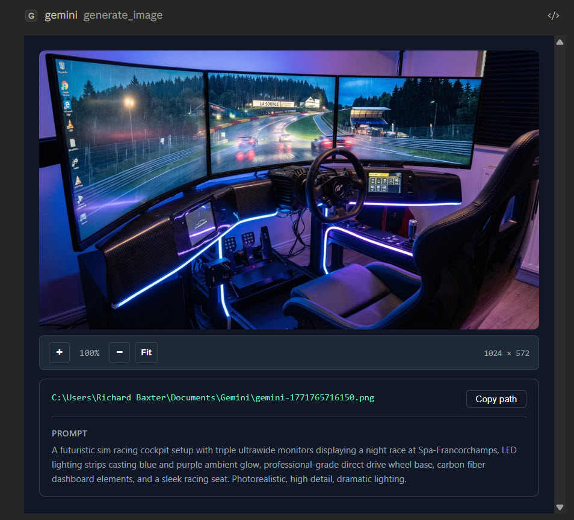
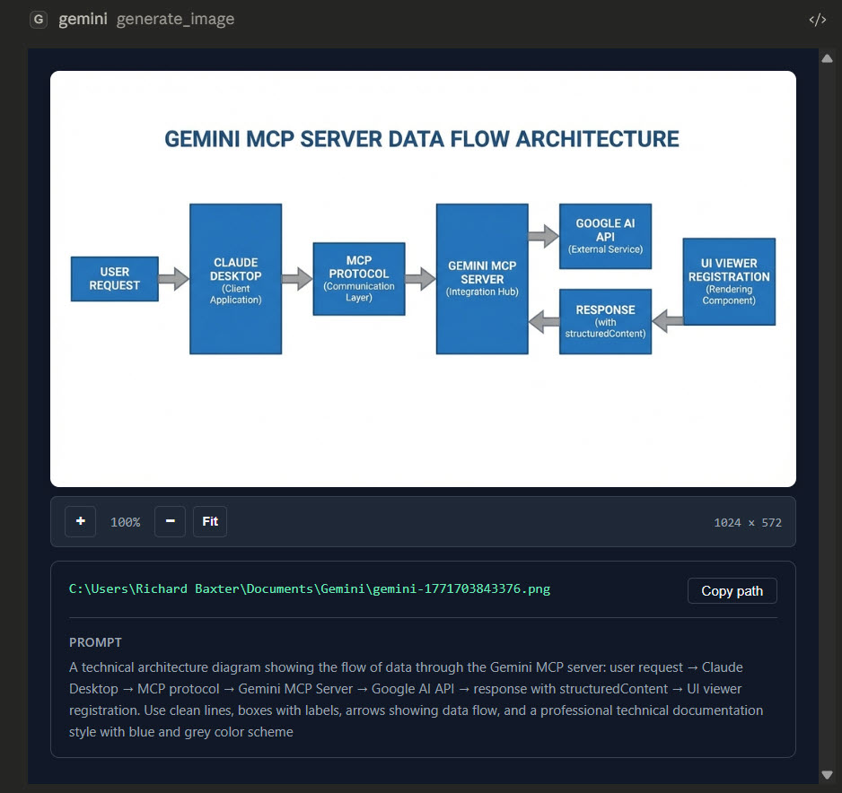
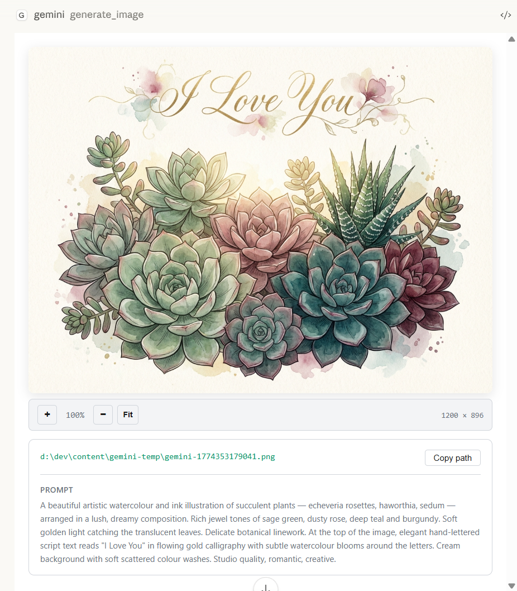
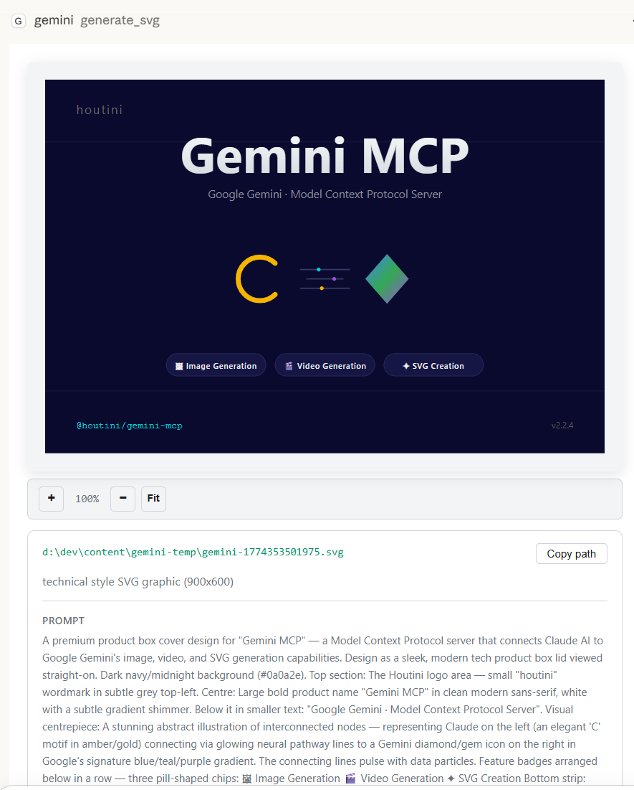
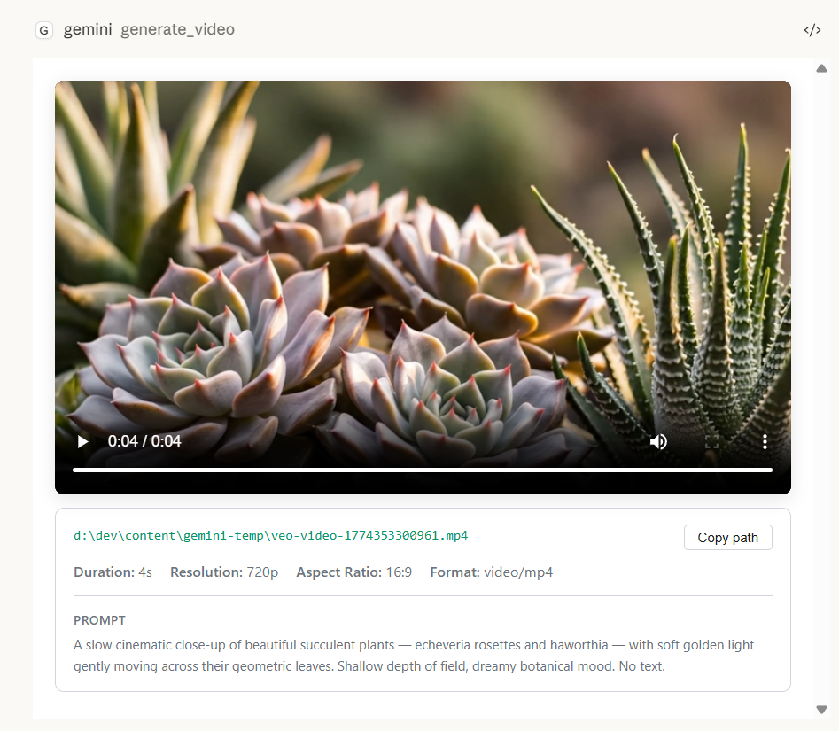

# @houtini/gemini-mcp

[](https://www.npmjs.com/package/@houtini/gemini-mcp)
[](https://registry.modelcontextprotocol.io)
[](https://snyk.io/test/github/houtini-ai/gemini-mcp)

I've been running this MCP server in my Claude Desktop setup for months. It's one of the few I leave on permanently — not because Gemini replaces Claude, but because grounded search, image generation, SVG diagrams, and video are things Gemini does genuinely well. Having them as tools inside Claude beats switching browser tabs.

Thirteen tools. One `npx` command.

<p align="center">
  <a href="https://glama.ai/mcp/servers/@houtini-ai/gemini-mcp">
    
  </a>
</p>

---

> **Quick Navigation**
>
> [Get started](#get-started-in-two-minutes) | [What it does](#what-it-does) | [SVG generation](#svg-generation) | [Image output](#image-output-and-storage) | [Configuration](#configuration-reference) | [Tools](#tools-reference) | [Models](#model-reference) | [Requirements](#requirements)

---

## What it looks like

Generated images, SVGs, and videos render inline in Claude Desktop with zoom controls, file paths, and prompt context:

| Image generation | SVG / diagram generation |
|:---:|:---:|
|  |  |

| Image embed | SVG embed | Video embed |
|:---:|:---:|:---:|
|  |  |  |

---

## Get started in two minutes

**Step 1: Get a Gemini API key**

Go to [Google AI Studio](https://aistudio.google.com/apikey) and create one. The free tier covers most development use — you'll hit rate limits on deep research if you're hammering it, but for day-to-day work it's fine.

**Step 2: Add to your Claude Desktop config**

Config file locations:
- Windows: `C:\Users\{username}\AppData\Roaming\Claude\claude_desktop_config.json`
- macOS: `~/Library/Application Support/Claude/claude_desktop_config.json`

```json
{
  "mcpServers": {
    "gemini": {
      "command": "npx",
      "args": ["@houtini/gemini-mcp"],
      "env": {
        "GEMINI_API_KEY": "your-api-key-here"
      }
    }
  }
}
```

**Step 3: Restart Claude Desktop**

That's it. Tools show up automatically. `npx` pulls the package on first run — no separate install needed.


### Local build instead

For development, or if you'd rather not rely on npx:

```bash
git clone https://github.com/houtini-ai/gemini-mcp
cd gemini-mcp
npm install --include=dev
npm run build
```

Then point your config at the local build:

```json
{
  "mcpServers": {
    "gemini": {
      "command": "node",
      "args": ["C:/path/to/gemini-mcp/dist/index.js"],
      "env": {
        "GEMINI_API_KEY": "your-api-key-here"
      }
    }
  }
}
```

### Claude Code (CLI)

Claude Code uses a different registration mechanism — it doesn't read `claude_desktop_config.json`. Use `claude mcp add` instead:

```bash
claude mcp add -e GEMINI_API_KEY=your-api-key-here -s user gemini -- npx -y @houtini/gemini-mcp
```

With optional image output directory:

```bash
claude mcp add \
  -e GEMINI_API_KEY=your-api-key-here \
  -e GEMINI_IMAGE_OUTPUT_DIR=/path/to/output \
  -s user \
  gemini -- npx -y @houtini/gemini-mcp
```

Verify with `claude mcp get gemini` — you should see `Status: Connected`.

---

## What it does

### Chat with Google Search grounding

```
Use gemini:gemini_chat to ask: "What changed in the MCP spec in the last month?"
```

Grounding is on by default. Gemini searches Google before answering, so you get current information rather than training cutoff answers. Sources come back as markdown links. For questions where you want pure reasoning — "explain this code" or similar — set `grounding: false`.

Supports `thinking_level` on Gemini 3 models: `high` for maximum reasoning depth, `low` to keep it fast, `medium`/`minimal` on Gemini 3 Flash only.

### Deep research

```
Use gemini:gemini_deep_research with:
  research_question="What are the current approaches to AI agent memory management?"
  max_iterations=5
```

Runs multiple grounded search iterations then synthesises a full report. Takes 2-5 minutes depending on complexity — worth it for anything needing comprehensive coverage rather than a quick answer.

Set `max_iterations` to 3-4 in Claude Desktop (4-minute tool timeout). In IDEs (Cursor, Windsurf, VS Code) or agent frameworks, 7-10 iterations produces noticeably better synthesis. Pass `focus_areas` as an array to steer toward specific angles.


### Image generation with search grounding

```
Use gemini:generate_image with:
  prompt="Stock price chart showing Apple (AAPL) closing prices for the last 5 trading days"
  use_search=true
  aspectRatio="16:9"
```

Default model is `gemini-3-pro-image-preview` (Nano Banana Pro). Also supports `gemini-2.5-flash-image` for faster generation.

When `use_search=true`, Gemini searches Google for current data before generating. Financial and news queries work reliably. The full-resolution image saves to disk automatically — the inline preview is resized for transport but the original is untouched.

### Video generation with Veo 3.1

```
Use gemini:generate_video with:
  prompt="A close-up shot of a futuristic coffee machine brewing a glowing blue espresso, steam rising dramatically. Cinematic lighting."
  resolution="1080p"
  durationSeconds=8
```

Uses Google's Veo 3.1 model. Generates 4-8 second videos at up to 4K with native synchronised audio. Processing takes 2-5 minutes — the tool polls automatically until ready.

Options worth knowing:
- `aspectRatio` — `16:9` landscape or `9:16` portrait/vertical
- `generateAudio` — on by default, produces dialogue and sound effects matching the prompt
- `sampleCount` — generate up to 4 variations in one call
- `seed` — deterministic output across runs
- `generateThumbnail` — extracts a frame via ffmpeg (needs ffmpeg in PATH)
- `firstFrameImage` — animate from a starting image (image-to-video)


### SVG generation

This is the one people underestimate. SVG output isn't just diagrams — it's production-ready vector graphics you can drop straight into a codebase, a presentation, or a web page. Clean, scalable, no raster artefacts.

```
Use gemini:generate_svg with:
  prompt="Architecture diagram showing a microservices system with API gateway, three services, and a shared database"
  style="technical"
  width=1000
  height=600
```

Four styles:

| Style | Best for |
|-------|----------|
| `technical` | Architecture diagrams, flowcharts, system maps |
| `artistic` | Illustrations, decorative graphics, icons |
| `minimal` | Clean data visualisations, simple charts |
| `data-viz` | Complex charts, dashboards, infographics |

The output is actual SVG code — edit it, animate it, embed it in HTML, commit it to a repo. No rasterising, no export steps, no Figma required.


### Image editing and analysis

**Conversational editing** — Gemini 3 Pro Image maintains context across editing turns. Pass thought signatures back on subsequent `edit_image` calls for full continuity:

```
Use gemini:edit_image with:
  prompt="Change the colour scheme to blue and green"
  images=[{data: imageBase64, mimeType: "image/png", thoughtSignature: "fromPreviousCall"}]
```

**Analysis** — two tools for different purposes:
- `describe_image` — Fast general descriptions using Gemini 3 Flash
- `analyze_image` — Structured extraction and detailed reasoning using Gemini 3.1 Pro

**Load local files:**
```
Use gemini:load_image_from_path with filePath="C:/screenshots/error.png"
```

### Media resolution control

Reduce token usage by up to 75% whilst maintaining quality for the task:

| Level | Tokens | Savings | Best for |
|-------|--------|---------|----------|
| `MEDIA_RESOLUTION_LOW` | 280 | 75% | Simple tasks, bulk operations |
| `MEDIA_RESOLUTION_MEDIUM` | 560 | 50% | PDFs/documents (OCR saturates here) |
| `MEDIA_RESOLUTION_HIGH` | 1120 | default | Detailed analysis |
| `MEDIA_RESOLUTION_ULTRA_HIGH` | 2000+ | per-image only | Maximum detail |

For PDF OCR, MEDIUM gives identical text extraction quality to HIGH at half the tokens.


### Landing page generation

```
Use gemini:generate_landing_page with:
  brief="A SaaS tool that helps developers monitor API latency"
  companyName="PingWatch"
  primaryColour="#6366F1"
  style="startup"
  sections=["hero", "features", "pricing", "cta"]
```

Returns a self-contained HTML file — inline CSS and vanilla JS, no external dependencies. Styles: `minimal`, `bold`, `corporate`, `startup`.

### Professional chart design systems

`gemini_prompt_assistant` includes 9 professional chart design systems:

| System | Inspiration | Best for |
|--------|------------|----------|
| **storytelling** | Cole Nussbaumer Knaflic | Executive presentations |
| **financial** | Financial Times | Editorial journalism — FT Pink, serif titles |
| **terminal** | Bloomberg / Fintech | High-density dark mode with neon |
| **modernist** | W.E.B. Du Bois | Bold geometric blocks, stark contrasts |
| **professional** | IBM Carbon / Tailwind | Enterprise dashboards |
| **editorial** | FiveThirtyEight / Economist | Data journalism |
| **scientific** | Nature / Science | Academic rigour |
| **minimal** | Edward Tufte | Maximum data-ink ratio |
| **dark** | Observable | Modern dark mode |

### Help system

```
Use gemini:gemini_help with topic="overview"
```

Full documentation without leaving Claude. Topics: `overview`, `image_generation`, `image_editing`, `image_analysis`, `chat`, `deep_research`, `grounding`, `media_resolution`, `models`, `all`.

---

## Image output and storage

By default, images return as inline previews rendered directly in Claude. Set `GEMINI_IMAGE_OUTPUT_DIR` to auto-save everything:

```json
"env": {
  "GEMINI_API_KEY": "your-api-key-here",
  "GEMINI_IMAGE_OUTPUT_DIR": "C:/Users/username/Pictures/gemini-output"
}
```

The server uses a two-tier approach to handle the MCP protocol's 1MB JSON-RPC limit whilst preserving full-resolution files:

| Tier | Purpose |
|------|---------|
| **Full-res** | Saved to disk immediately, untouched |
| **Preview** | Resized JPEG for inline transport — dynamically sized to fit under the cap |

Gemini returns 2-5MB images. The resize is smart — it measures the non-image overhead in each response and calculates the exact binary budget available, stepping down dimensions (800→600→400→300→200px) until it fits. The full image is always there on disk.

---

## Configuration reference

| Variable | Required | Default | Description |
|----------|----------|---------|-------------|
| `GEMINI_API_KEY` | Yes | — | Google AI API key from [AI Studio](https://aistudio.google.com/apikey) |
| `GEMINI_DEFAULT_MODEL` | No | `gemini-3.1-pro-preview` | Default model for `gemini_chat` and `analyze_image` |
| `GEMINI_DEFAULT_GROUNDING` | No | `true` | Enable Google Search grounding by default |
| `GEMINI_IMAGE_OUTPUT_DIR` | No | — | Auto-save directory for generated images and videos |
| `GEMINI_ALLOW_EXPERIMENTAL` | No | `false` | Include experimental/preview models in auto-discovery |
| `GEMINI_MCP_LOG_FILE` | No | `false` | Write logs to `~/.gemini-mcp/logs/` |
| `DEBUG_MCP` | No | `false` | Log to stderr for debugging tool calls |


## Tools reference

| Tool | Description |
|------|-------------|
| `gemini_chat` | Chat with Gemini 3.1 Pro. Google Search grounding on by default. Supports `thinking_level` |
| `gemini_deep_research` | Multi-step iterative research with Google Search. Synthesises comprehensive reports |
| `gemini_list_models` | Lists available models from the Gemini API |
| `gemini_help` | Documentation for all features without leaving Claude |
| `gemini_prompt_assistant` | Expert guidance for image generation with 9 chart design systems |
| `generate_image` | Image generation with optional search grounding. Full-res saved to disk |
| `edit_image` | Edit images with natural-language instructions. Multi-turn continuity via thought signatures |
| `describe_image` | Fast image descriptions using Gemini 3 Flash |
| `analyze_image` | Structured extraction and analysis using Gemini 3.1 Pro |
| `load_image_from_path` | Read a local image file and return base64 for any image tool |
| `generate_video` | Video generation with Veo 3.1 — 4-8 seconds at up to 4K with native audio |
| `generate_svg` | Production-ready SVG: diagrams, illustrations, icons, data visualisations |
| `generate_landing_page` | Self-contained HTML landing pages with inline CSS/JS |

---

## Model reference

| Model | Used by | Notes |
|-------|---------|-------|
| `gemini-3.1-pro-preview` | `gemini_chat`, `analyze_image` | Default. Advanced reasoning |
| `gemini-3-pro-image-preview` | `generate_image`, `edit_image` | Nano Banana Pro — highest quality image generation |
| `gemini-2.5-flash-image` | `generate_image` (optional) | Faster generation, higher volume |
| `gemini-3-flash-preview` | `describe_image` | Fast general descriptions |
| `veo-3.1-generate-preview` | `generate_video` | Veo 3.1 — 4K video with native audio |

**Gemini 3 notes:** Temperature is forced to 1.0 on Gemini 3 models (Google's requirement — lower values cause looping). Thinking level only applies to `gemini_chat`.

---

## Requirements

- Node.js 18+
- A Gemini API key from [Google AI Studio](https://aistudio.google.com/apikey)
- ffmpeg (optional, for video thumbnail extraction)

## Licence

Apache-2.0
